# Minecraft-like Game Scene Renderer
Group 3 of CSIT6000L Digital Design, 2022 Spring

## Test
```
./test_all.sh
```

## Blurring Feature
### Examples

*Normal output*


*Blurred with focus_length=6.5*


*Blurred with focus_length=3.5*

### Flag
```
-blurry [focus_length] [output_file]
```

# Web UI
## Online Preview
[via GitHub Page](https://yaindrop.github.io/6000lproj/)
## Serve from local (via Python 3)
```bash
git clone https://github.com/yaindrop/6000lproj.git

cd 6000lproj

python -m http.server
```
## Features
### In-Browser Rendering

The Web UI is powered by [WebAssembly](https://webassembly.org/) and [Emscripten](https://emscripten.org/), which can run the C++ renderer entirely inside the browser, without the need for any backend

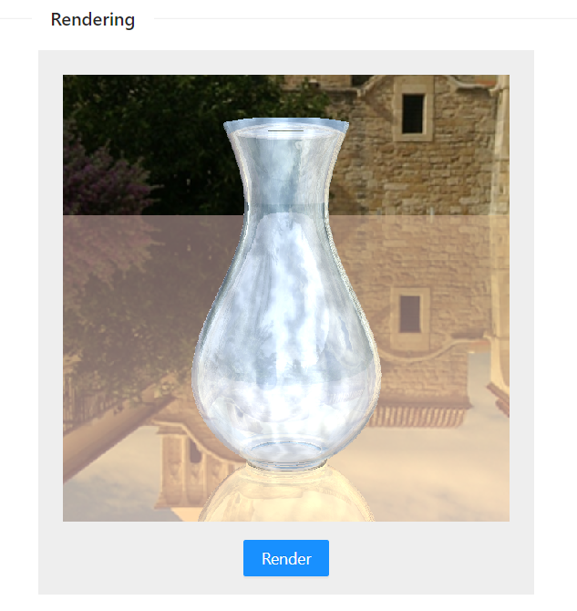

#### Progress Bar and Stop

A progress bar is provided for better user experience. The rendering can also be manually stopped in case it's too slow with some arguments

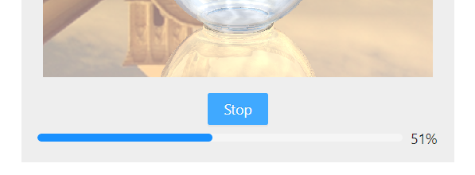

#### Feedback frequency

The feedback frequency indicates how many times in a second to interrupt the rendering and report progress or receive stop instruction. It can be used as a trade-off between rendering time and UI responsiveness

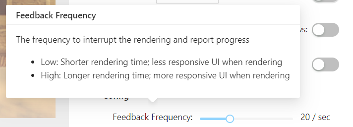

### Argument Settings Panel

The arguments settings panel can control all the rendering arguments intuitively


#### Input Scene File Selector

The input scene file is entered through a cascading selector

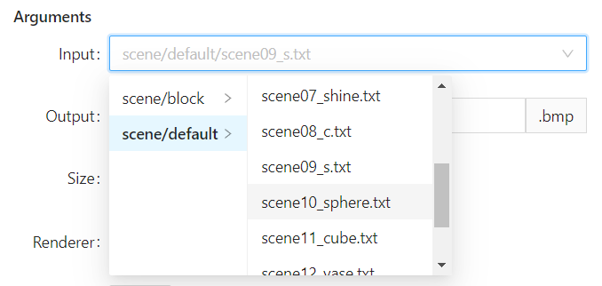

#### Command generating

The CLI command can also be generated with the settings panel

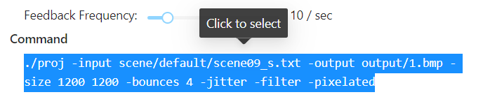

### File System Sandbox

The Web UI also provides a file system sandbox based on the [Emscripten FS API](https://emscripten.org/docs/api_reference/Filesystem-API.html), allowing easy access to scene definition files and output files

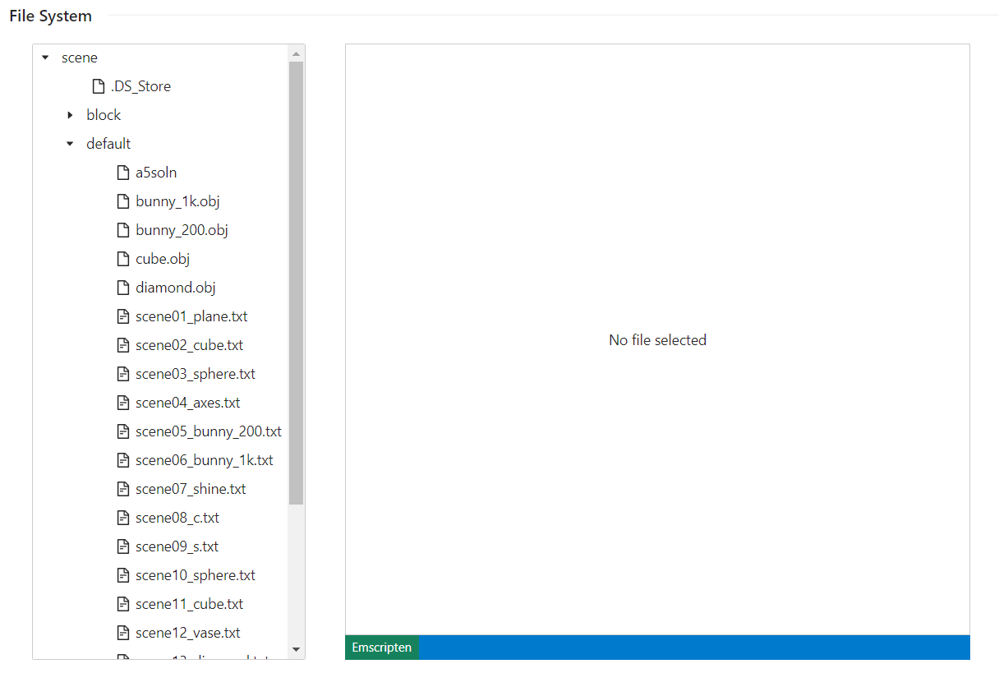

### Scene Definition Editor

The file system sandbox comes with a scene definition editor powered by the [Monaco Editor](https://microsoft.github.io/monaco-editor/)

#### Parsing the Scene Definition DSL

To improve the editing experience, the scene definition DSL is parsed using the [Chevrotain Parser Building Toolkit](https://chevrotain.io/). The Concrete Syntax Tree (CST) is visualized as the following rail diagram

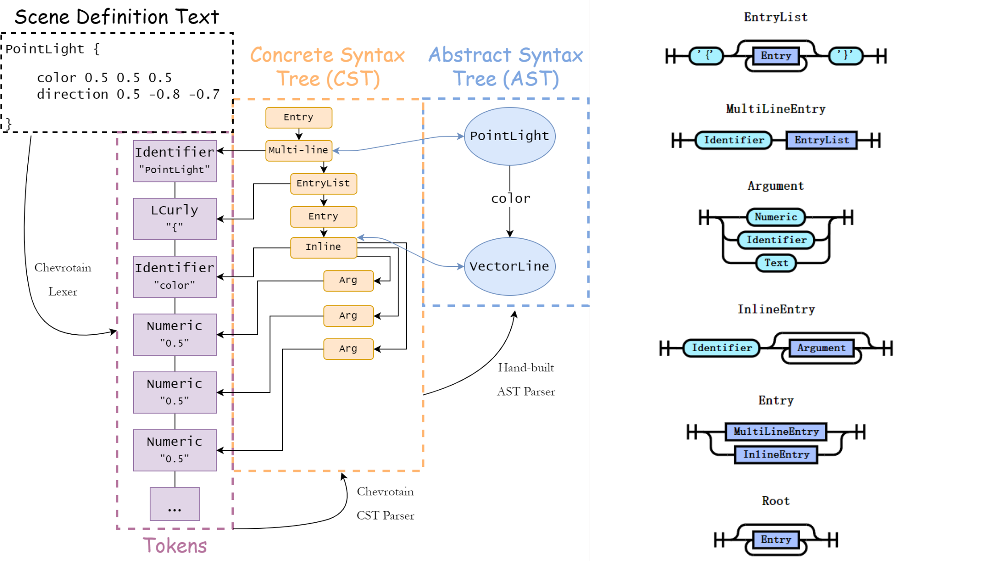

The parsed scene CST is then converted and binded to corresponding Abstract Syntax Tree (AST) ([defined here](front/src/scene/ast.ts)), which is used to generate a series of functionality providers used by the Monaco Editor

#### Semantic Highlighting

The tokens in the scene definition files are colored according to their corresponding AST type

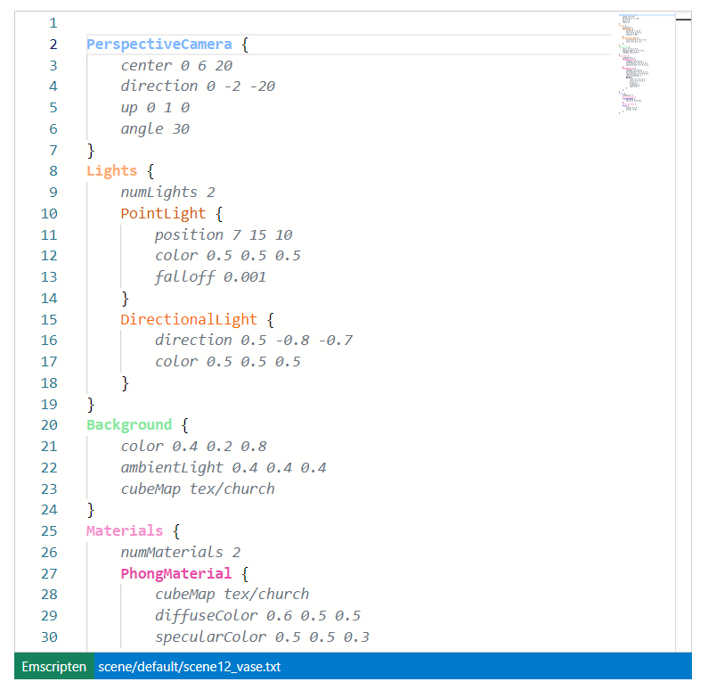

#### Semantic Parsing & Error Suggestion

Upon a failed AST parsing, the failed token is located and an error message is displayed

- Unexpected Name
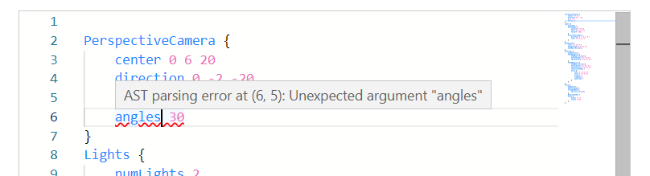
- Unexpected Value
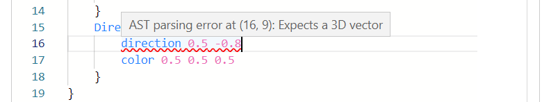
- Misplaced Block

- Missing Argument
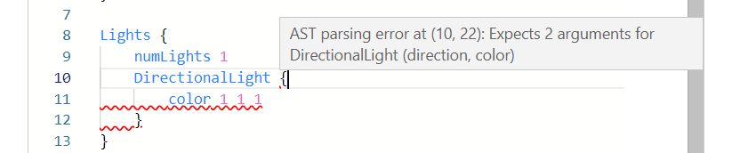

#### Auto-formatter

The auto-fromatter is also built with the AST and can be invoked using ```Shift+Alt+F```

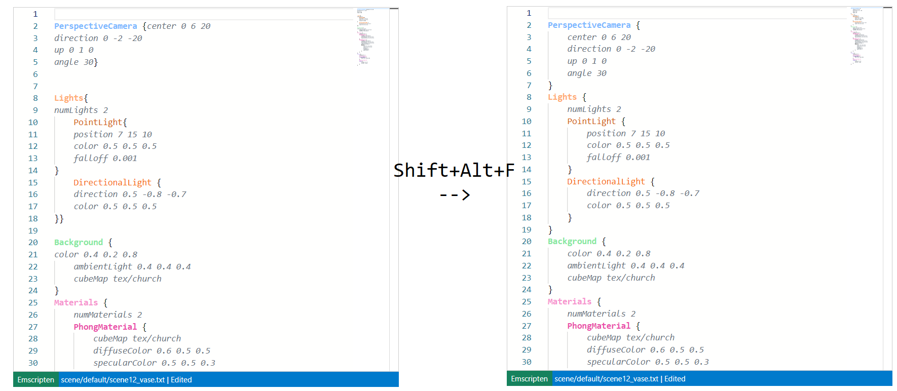

## Build Prerequisites
1. Linux environment preferred (Arch Linux / Ubuntu) 
 - [Windows Subsystem of Linux](https://docs.microsoft.com/en-us/windows/wsl/install) is recommended
     - [Ubuntu WSL](https://ubuntu.com/wsl)
     - [Arch WSL](https://github.com/yuk7/ArchWSL)

2. [NodeJS](https://nodejs.org/en/) (v17.9.0 or above) and [NPM](https://www.npmjs.com/)
```bash
# For Arch Linux
sudo pacman -S nodejs npm

# For Ubuntu
sudo apt-get install nodejs
```

3. [Yarn Package Manager](https://yarnpkg.com/)
```bash
npm install --global yarn
```

4. [Emscripten SDK](https://emscripten.org/docs/tools_reference/emsdk.html) (in ~/emsdk by default)
```bash
cd ~

# Get the emsdk repo
git clone https://github.com/emscripten-core/emsdk.git

# Enter that directory
cd emsdk

# Fetch the latest version of the emsdk (not needed the first time you clone)
git pull

# Download and install the latest SDK tools.
./emsdk install latest

# Make the "latest" SDK "active" for the current user. (writes .emscripten file)
./emsdk activate latest
```

## Build
1. In the project directory, build the web module using Emscripten SDK

```bash
# Activate PATH and other environment variables in the current terminal
source ~/emsdk/emsdk_env.sh

# Build the project
emmake make web
```

2. Install node modules
```bash
# Enter the front directory
cd front

# Install node modules
yarn
```

3. Host the frontend
- Start the development server
    ```bash
    yarn start
    ```

-  or build packaged frontend
    ```bash
    yarn build
    
    # If you have python installed, start HTTP server to view results
    python -m http.server -d dist/
    ```
    
